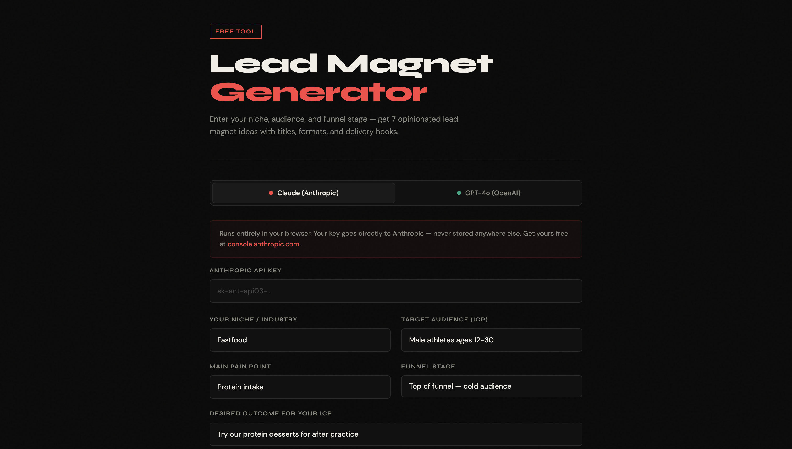

# Lead Magnet Generator

A free, open-source AI tool that generates 7 opinionated lead magnet ideas based on your niche, audience, and funnel stage — with titles, formats, and delivery hooks.

Built with the Anthropic Claude API. Runs entirely in your browser, no backend required.



## Features

- 7 tailored lead magnet ideas per generation
- Matched to your funnel stage (top, mid, bottom)
- Includes title, format, hook, conversion reasoning, and implementation note
- Copy individual ideas or all at once
- Runs client-side — your API key never leaves your browser

## Model Support

| Model | Status |
|---|---|
| Claude (Anthropic) | ✅ Fully supported |
| GPT-4o (OpenAI) | ⚡ Experimental |

> Note: Claude is the primary supported model. OpenAI support is experimental — if you run into issues, Claude is your best bet.

## Usage

1. Clone the repo
2. Open `index.html` with any local server (e.g. `python3 -m http.server 8080`)
3. Grab a free API key at [console.anthropic.com](https://console.anthropic.com)
4. Enter your niche, audience, pain point, and funnel stage
5. Hit Generate

## Stack

- Vanilla HTML, CSS, JS — no frameworks, no dependencies
- Claude API (`claude-sonnet-4-5`)
- Hosted on GitHub Pages

## Local Setup
```bash
git clone https://github.com/YOUR_USERNAME/lead-magnet-generator
cd lead-magnet-generator
python3 -m http.server 8080
```

Then open `http://localhost:8080`

## License

MIT